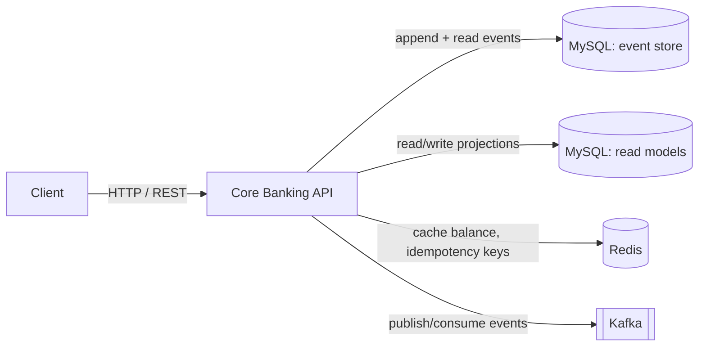
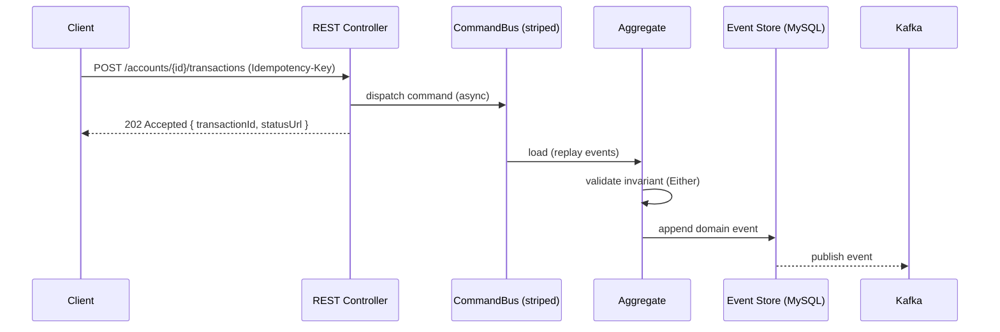
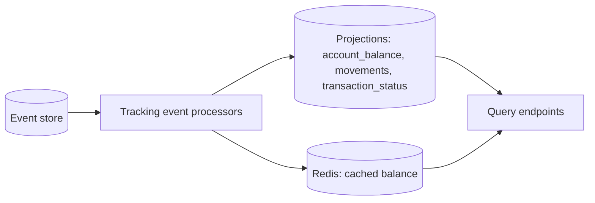
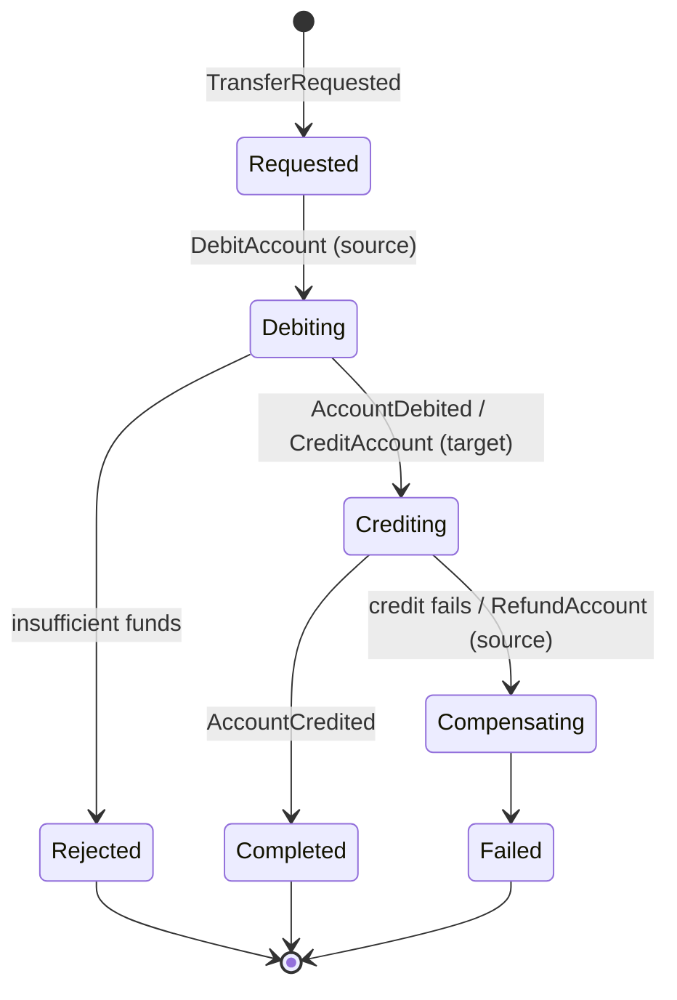

# Architecture

Core Banking API — a REST service that simulates a core banking process. This document describes the
**desired architecture**. Functional detail, scope, and the gap analysis live in
[`docs/superpowers/specs/2026-07-24-banking-api-design.md`](docs/superpowers/specs/2026-07-24-banking-api-design.md).

## Architectural style

The system is a single service and a single bounded context (**Core Banking**) built on:

- **Domain-Driven Design** — explicit aggregates, value objects, and a ubiquitous language expressed
  in commands and events.
- **Hexagonal architecture** (ports and adapters) — the domain sits at the centre, isolated from
  infrastructure by ports; adapters plug in at the edges.
- **CQRS** — the write side (commands, aggregates, event store) is separate from the read side
  (projections, query endpoints), with a different model on each.
- **Event Sourcing** — the event store is the source of truth; state is reconstructed by replaying
  events. Account balance is a fold over an account's events.
- **Event-driven** — domain events are published to Kafka and drive projections and any downstream
  consumer.
- **Asynchronous processing** — commands are dispatched asynchronously; write endpoints return
  `202 Accepted` and projections are eventually consistent.
- **Functional programming** — domain operations return `Either<DomainError, Result>` (Vavr) instead
  of throwing for business-rule failures; value objects and events are immutable.

## System context



- **MySQL** holds both the event store (truth) and the projection tables (read models).
- **Redis** caches balances and stores idempotency keys.
- **Kafka** is the event-distribution bus, not an event store.

## Hexagonal layers

```
inbound adapters   REST controllers (Spring MVC), RFC 7807 problem+json mapping
        │  (drives)
        ▼
application         command gateway, query services, transaction-status service  ── ports
        │  (uses)
        ▼
domain              aggregates, value objects, domain events, invariants   ← centre
        ▲  (implemented by)
        │
outbound adapters  JDBC event store (MySQL), projection repositories (MySQL),
                   Redis cache, Kafka publisher/consumer
```

Dependencies point inward. The domain depends on nothing outside itself. Application depends on the
domain and defines ports; adapters depend on the application/domain and implement or drive those
ports.

### Package structure (target)

```
com.example.banking
├── eventsourcing           # DIY kernel: ports + pure logic (Vavr only, no infrastructure)
├── domain                  # pure domain — implements kernel interfaces, zero framework imports
│   ├── user                #   User aggregate, events
│   ├── account             #   Account aggregate, events, invariants
│   ├── transfer            #   Transfer saga (pure state machine)
│   └── shared              #   Money, identifiers, DomainError (value objects)
├── application             # command/query gateways, ports (interfaces)
│   ├── command
│   └── query
└── adapter
    ├── in.web              # REST controllers, DTOs, error mapping
    └── out
        ├── eventstore      # JDBC event store, snapshots, tokens, sagas, deadlines, serialization
        ├── projection      # JPA projection entities + repositories, tracking processors
        ├── cache           # Redis
        └── messaging       # Kafka relay processor (spring-kafka)
```

The domain has **no framework touchpoint at all**: aggregates implement the kernel's pure
`AggregateBehaviour` (decide/evolve) interface and sagas implement `SagaBehaviour` — plain Java
against a dependency-free kernel package. All infrastructure stays in `adapter`.

## Write model (command side)



The aggregate is rehydrated by replaying its events, validates the command against its invariants
(for example, no overdraft), and — on success — applies a new event that is appended to the store and
published.

## Read model (query side)



Kernel tracking processors poll the event store with persisted tokens, maintain projections in
MySQL (token + projection updated in one transaction), and can be reset to rebuild a projection
from the start of the stream. The balance projection is cached in Redis. Query endpoints read only
from projections — never from the event store.

## Aggregates and events

| Aggregate | Sourcing | Key events | Invariant |
| --- | --- | --- | --- |
| User | event-sourced | `UserRegistered` | — |
| Account | event-sourced | `AccountOpened`, `MoneyDeposited`, `MoneyWithdrawn`, `AccountDebited`, `AccountCredited` | no overdraft; EUR only |

Value objects: `Money` (integer minor units / cents, EUR), `UserId`, `AccountId`, `TransactionId`,
`ExternalAccountRef`.

## Transfer saga

A transfer touches two Account aggregates, so it is coordinated by a saga with compensation rather
than a single transaction.



## Event distribution (Kafka)

Domain events are relayed to Kafka by a dedicated kernel tracking processor using `spring-kafka`,
forming the event-driven backbone and the seam for a future real external-bank integration. Kafka
carries events outward; it is explicitly not the event store. Delivery is at-least-once; consumers
deduplicate on `event_id`.

## Idempotency and concurrency

- **Idempotency** — the client's `Idempotency-Key` is used as the `TransactionId`. Replays return the
  original transaction status and produce no second movement. Keys are tracked in Redis (TTL) and
  backed by a unique constraint in the `transaction_status` projection.
- **Concurrency** — optimistic locking via the event store's unique `(aggregate_id, sequence_nr)`
  key serializes concurrent commands on the same account; the command bus additionally routes
  same-aggregate commands onto one executor stripe. Conflicts are retried (3 attempts); exhausted
  retries surface as `409 Conflict`.

## Cross-cutting concerns

- **Error handling** — business outcomes are `Either<DomainError, Result>` mapped to RFC 7807
  `problem+json`. Asynchronous transfer failures surface as a transaction status (`REJECTED` /
  `FAILED`) with a reason, not as an HTTP error on the original request.
- **Observability** — Spring Boot Actuator plus Micrometer / OpenTelemetry.
- **Schema** — Flyway manages all schemas: projections and the kernel tables (event store,
  snapshots, tracking tokens, sagas, deadlines).

## Architectural rules (enforced by the DIY ArchCheck test)

A hand-built checker on the JDK ClassFile API (`java.lang.classfile` — no ArchUnit, which is
incompatible with the Java version in use) scans compiled classes and enforces:

- `eventsourcing` (the kernel) must depend only on itself, Vavr, and `java.` — no infrastructure.
- `domain` must depend only on itself, `eventsourcing`, Vavr, and `java.` — no `adapter`, no
  web/persistence/Redis/Kafka packages.
- `adapter.in.web` must not reference aggregates directly — only application gateways/services.
- Value objects and events must be immutable.

## Technology mapping

| Concern | Technology |
| --- | --- |
| Runtime / framework | Java 26, Spring Boot 4.1 (Spring Framework 7) |
| ES / CQRS / sagas | DIY event-sourcing kernel (`com.example.banking.eventsourcing`, see the [design spec](docs/superpowers/specs/2026-07-24-diy-event-sourcing-design.md)) |
| Event store | MySQL 9.7 (JDBC, Flyway-managed schema) |
| Event bus | Apache Kafka via `spring-kafka` (kernel tracking-processor relay) |
| Read models | MySQL 9.7 (Spring Data JPA) |
| Cache / idempotency | Redis 8.8 (Spring Data Redis) |
| Migrations | Flyway |
| Functional | Vavr |
| Serialization | Jackson 3 (`tools.jackson`) — in the adapter only |
| API / validation | Spring Web MVC, springdoc-openapi, Jakarta Bean Validation |
| Testing | JUnit 5, kernel GWT fixtures, DIY `ArchCheck` (JDK ClassFile API), Testcontainers, AssertJ |

Event sourcing, CQRS, and sagas are provided by the hand-built kernel rather than a framework;
see [`docs/superpowers/specs/2026-07-24-diy-event-sourcing-design.md`](docs/superpowers/specs/2026-07-24-diy-event-sourcing-design.md)
for its design and the rationale for replacing Axon.
