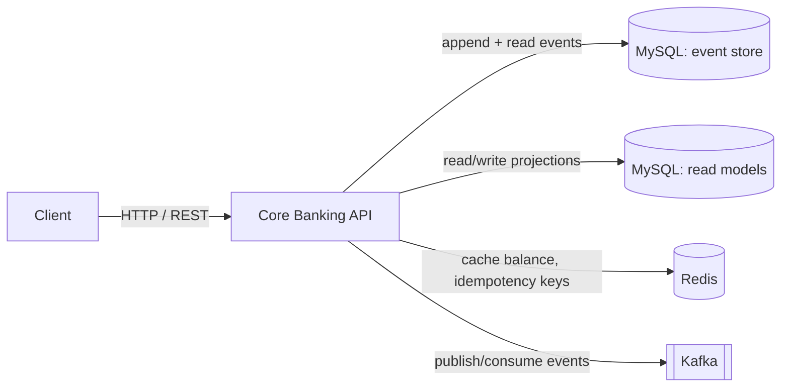
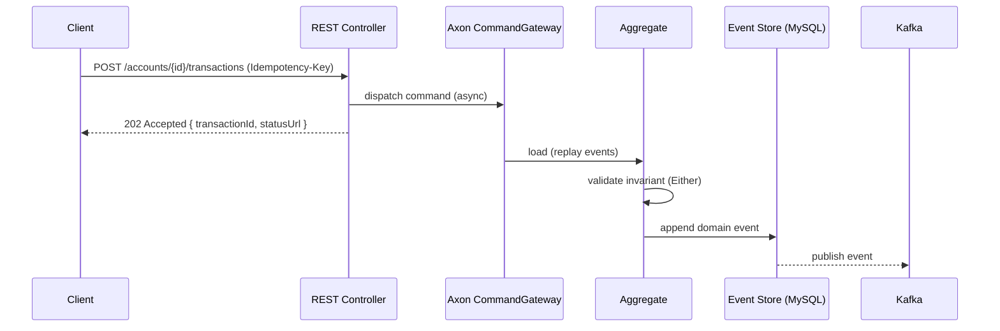
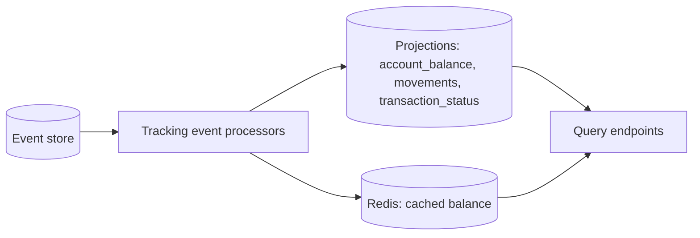
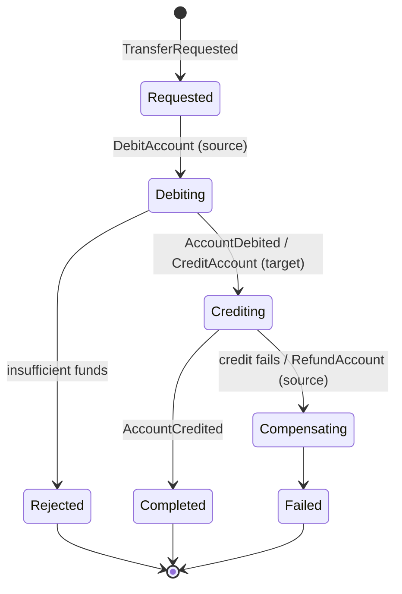

# Architecture

Core Banking API — a REST service that simulates a core banking process. This document describes the
**desired architecture**. Functional detail, scope, and the gap analysis live in
[`docs/superpowers/specs/2026-07-24-banking-api-design.md`](docs/superpowers/specs/2026-07-24-banking-api-design.md).

## Architectural style

The system is a single service and a single bounded context (**Core Banking**) built on:

- **Domain-Driven Design** — explicit aggregates, value objects, and a ubiquitous language expressed
  in commands and events.
- **Hexagonal architecture** (ports and adapters) — the domain sits at the centre, isolated from
  infrastructure by ports; adapters plug in at the edges.
- **CQRS** — the write side (commands, aggregates, event store) is separate from the read side
  (projections, query endpoints), with a different model on each.
- **Event Sourcing** — the event store is the source of truth; state is reconstructed by replaying
  events. Account balance is a fold over an account's events.
- **Event-driven** — domain events are published to Kafka and drive projections and any downstream
  consumer.
- **Asynchronous processing** — commands are dispatched asynchronously; write endpoints return
  `202 Accepted` and projections are eventually consistent.
- **Functional programming** — domain operations return `Either<DomainError, Result>` (Vavr) instead
  of throwing for business-rule failures; value objects and events are immutable.

## System context



- **MySQL** holds both the Axon event store (truth) and the projection tables (read models).
- **Redis** caches balances and stores idempotency keys.
- **Kafka** is the event-distribution bus, not an event store.

## Hexagonal layers

```
inbound adapters   REST controllers (Spring MVC), RFC 7807 problem+json mapping
        │  (drives)
        ▼
application         command gateway, query services, transaction-status service  ── ports
        │  (uses)
        ▼
domain              aggregates, value objects, domain events, invariants   ← centre
        ▲  (implemented by)
        │
outbound adapters  Axon event store (MySQL/JPA), projection repositories (MySQL),
                   Redis cache, Kafka publisher/consumer
```

Dependencies point inward. The domain depends on nothing outside itself. Application depends on the
domain and defines ports; adapters depend on the application/domain and implement or drive those
ports.

### Package structure (target)

```
com.example.banking
├── domain                  # pure domain + Axon aggregate/saga annotations only
│   ├── user                #   User aggregate, events
│   ├── account             #   Account aggregate, events, invariants
│   ├── transfer            #   Transfer saga
│   └── shared              #   Money, identifiers, DomainError (value objects)
├── application             # command/query gateways, ports (interfaces)
│   ├── command
│   └── query
└── adapter
    ├── in.web              # REST controllers, DTOs, error mapping
    └── out
        ├── eventstore      # Axon storage-engine config (MySQL)
        ├── projection      # JPA projection entities + repositories, event processors
        ├── cache           # Redis
        └── messaging       # Kafka publisher/consumer (Axon extension-kafka)
```

Axon annotations (`@Aggregate`, `@CommandHandler`, `@EventSourcingHandler`, saga handlers) are the one
permitted framework touchpoint inside `domain` — idiomatic for Axon. All other infrastructure stays in
`adapter`.

## Write model (command side)



The aggregate is rehydrated by replaying its events, validates the command against its invariants
(for example, no overdraft), and — on success — applies a new event that is appended to the store and
published.

## Read model (query side)



Event processors consume events and maintain projections in MySQL; the balance projection is cached in
Redis. Query endpoints read only from projections — never from the event store.

## Aggregates and events

| Aggregate | Sourcing | Key events | Invariant |
| --- | --- | --- | --- |
| User | event-sourced | `UserRegistered` | — |
| Account | event-sourced | `AccountOpened`, `MoneyDeposited`, `MoneyWithdrawn`, `AccountDebited`, `AccountCredited` | no overdraft; EUR only |

Value objects: `Money` (integer minor units / cents, EUR), `UserId`, `AccountId`, `TransactionId`,
`ExternalAccountRef`.

## Transfer saga

A transfer touches two Account aggregates, so it is coordinated by a saga with compensation rather
than a single transaction.



## Event distribution (Kafka)

Domain events are published to Kafka via the Axon Kafka extension, forming the event-driven backbone
and the seam for a future real external-bank integration. Kafka carries events outward; it is
explicitly not the event store.

## Idempotency and concurrency

- **Idempotency** — the client's `Idempotency-Key` is used as the `TransactionId`. Replays return the
  original transaction status and produce no second movement. Keys are tracked in Redis (TTL) and
  backed by a unique constraint in the `transaction_status` projection.
- **Concurrency** — Axon aggregate optimistic locking (event sequence numbers) serializes concurrent
  commands on the same account. Conflicts are retried; exhausted retries surface as `409 Conflict`.

## Cross-cutting concerns

- **Error handling** — business outcomes are `Either<DomainError, Result>` mapped to RFC 7807
  `problem+json`. Asynchronous transfer failures surface as a transaction status (`REJECTED` /
  `FAILED`) with a reason, not as an HTTP error on the original request.
- **Observability** — Spring Boot Actuator plus Micrometer / OpenTelemetry.
- **Schema** — Flyway manages projection schemas; the Axon event-store schema is created by
  Axon / Hibernate.

## Architectural rules (enforced by ArchUnit)

- `domain` must not depend on `adapter` or on web/persistence/Redis/Kafka packages.
- `adapter.in.web` must not reference aggregates directly — only application gateways/services.
- Value objects and events must be immutable.

## Technology mapping

| Concern | Technology |
| --- | --- |
| Runtime / framework | Java 26, Spring Boot 4.1 (Spring Framework 7) |
| ES / CQRS / sagas | Axon Framework 5 |
| Event store | MySQL 9.7 (Axon `EmbeddedEventStore`, JPA/JDBC engine) |
| Event bus | Apache Kafka (Axon `extension-kafka`) |
| Read models | MySQL 9.7 (Spring Data JPA) |
| Cache / idempotency | Redis 8.8 (Spring Data Redis) |
| Migrations | Flyway |
| Functional | Vavr |
| API / validation | Spring Web MVC, springdoc-openapi, Jakarta Bean Validation |
| Testing | JUnit 5, Axon test fixtures, ArchUnit, Testcontainers, AssertJ |

See the design specification for compatibility notes (Java 26 vs the Java 25 support line, Axon 4
end-of-life, `extension-kafka` on Axon 5).
